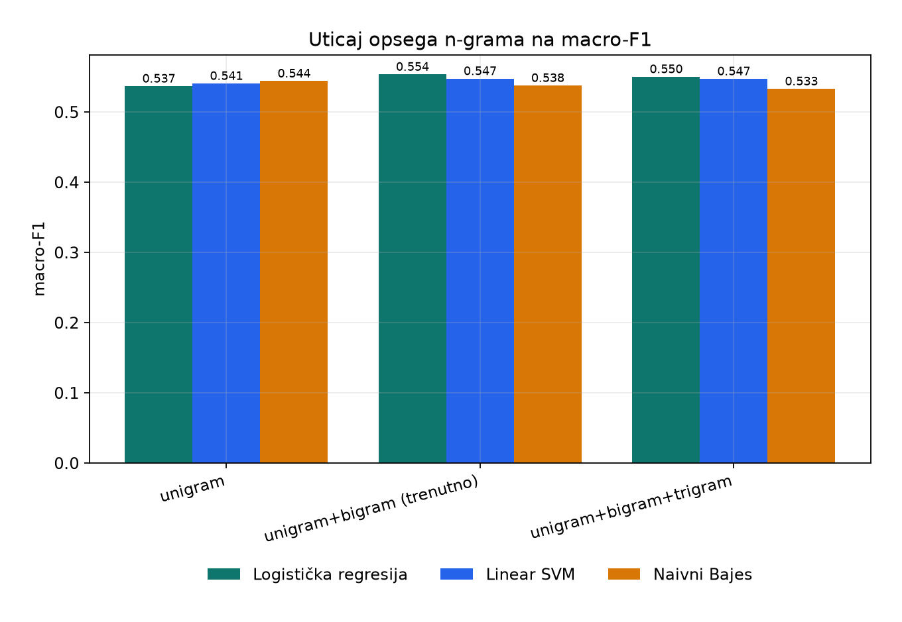
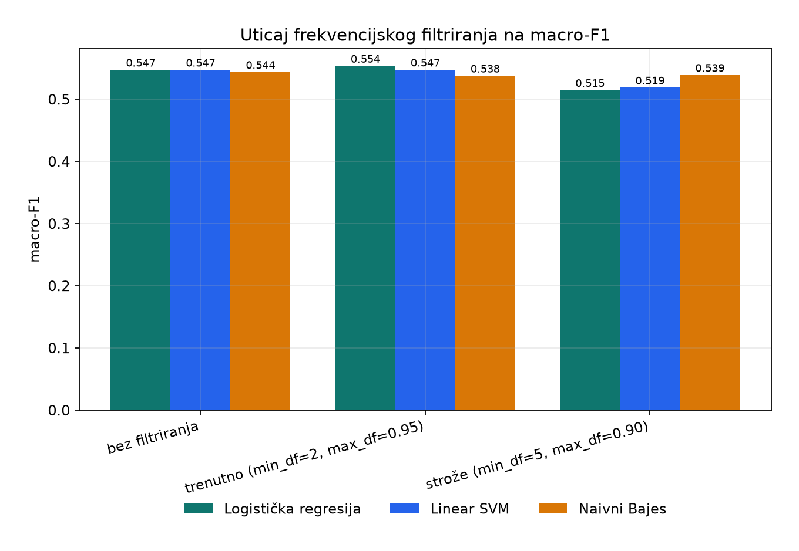

# Ablacija: opseg n-grama i frekvencijsko filtriranje[cite: 1]

Dopuna baseline eksperimenata (Faza 3.1) — testira uticaj dve odlike vektorizacije koje su ranije bile fiksne u svim konfiguracijama (`ngram_range=(1,2)`, `min_df=2`, `max_df=0.95`). Umesto pune mreže (što bi eksplodiralo kombinacije), svaka osa se menja pojedinačno na **pobedničkoj konfiguraciji svakog modela** iz pune mreže — tako se efekat vidi kroz sve tri porodice modela (LR/SVM/NB), a ne samo na jednoj tačci[cite: 1].

## 1. Polazne (pobedničke) konfiguracije po modelu[cite: 1]

| Model | weighting | lowercase | normalize | macro-F1 (puna mreža) |
|---|---|---|---|---|
| Logistička regresija | tf | True | stem | 0.5532[cite: 1] |
| Linear SVM | tf | True | stem | 0.5475[cite: 1] |
| Naivni Bajes | idf | True | stem | 0.5377[cite: 1] |

## 2. Uticaj opsega n-grama[cite: 1]

[cite: 1]

| Podešavanje | macro-F1 | accuracy | F1 NEUTRAL | F1 ZA-VLAST | F1 PROTIV-VLASTI |
|---|---|---|---|---|---|
| unigram | 0.5367 | 0.5647 | 0.3654 | 0.6343 | 0.6106[cite: 1] |
| unigram+bigram (trenutno) | 0.5535 | 0.5828 | 0.3809 | 0.6461 | 0.6337[cite: 1] |
| unigram+bigram+trigram | 0.5502 | 0.5779 | 0.3833 | 0.6395 | 0.6279[cite: 1] |

**Logistička regresija**: trenutno podešavanje je i dalje najbolje od testiranih (macro-F1=0.5535)[cite: 1].

| Podešavanje | macro-F1 | accuracy | F1 NEUTRAL | F1 ZA-VLAST | F1 PROTIV-VLASTI |
|---|---|---|---|---|---|
| unigram | 0.5406 | 0.5765 | 0.3456 | 0.6480 | 0.6280[cite: 1] |
| unigram+bigram (trenutno) | 0.5475 | 0.5846 | 0.3564 | 0.6429 | 0.6432[cite: 1] |
| unigram+bigram+trigram | 0.5471 | 0.5842 | 0.3565 | 0.6445 | 0.6404[cite: 1] |

**Linear SVM**: trenutno podešavanje je i dalje najbolje od testiranih (macro-F1=0.5475)[cite: 1].

| Podešavanje | macro-F1 | accuracy | F1 NEUTRAL | F1 ZA-VLAST | F1 PROTIV-VLASTI |
|---|---|---|---|---|---|
| unigram | 0.5440 | 0.5755 | 0.3540 | 0.6550 | 0.6232[cite: 1] |
| unigram+bigram (trenutno) | 0.5377 | 0.5682 | 0.3528 | 0.6386 | 0.6217[cite: 1] |
| unigram+bigram+trigram | 0.5329 | 0.5651 | 0.3410 | 0.6320 | 0.6257[cite: 1] |

**Naivni Bajes**: najbolje podešavanje je „unigram” (macro-F1=0.5440), Δ=+0.0064 u odnosu na trenutno[cite: 1].

## 3. Uticaj frekvencijskog filtriranja[cite: 1]

[cite: 1]

| Podešavanje | macro-F1 | accuracy | F1 NEUTRAL | F1 ZA-VLAST | F1 PROTIV-VLASTI |
|---|---|---|---|---|---|
| bez filtriranja | 0.5474 | 0.5755 | 0.3700 | 0.6506 | 0.6215[cite: 1] |
| trenutno (min_df=2, max_df=0.95) | 0.5535 | 0.5828 | 0.3809 | 0.6461 | 0.6337[cite: 1] |
| strože (min_df=5, max_df=0.90) | 0.5147 | 0.5418 | 0.3482 | 0.6098 | 0.5861[cite: 1] |

**Logistička regresija**: trenutno podešavanje je i dalje najbolje od testiranih (macro-F1=0.5535)[cite: 1].

| Podešavanje | macro-F1 | accuracy | F1 NEUTRAL | F1 ZA-VLAST | F1 PROTIV-VLASTI |
|---|---|---|---|---|---|
| bez filtriranja | 0.5473 | 0.5713 | 0.3815 | 0.6550 | 0.6054[cite: 1] |
| trenutno (min_df=2, max_df=0.95) | 0.5475 | 0.5846 | 0.3564 | 0.6429 | 0.6432[cite: 1] |
| strože (min_df=5, max_df=0.90) | 0.5187 | 0.5550 | 0.3288 | 0.6193 | 0.6079[cite: 1] |

**Linear SVM**: trenutno podešavanje je i dalje najbolje od testiranih (macro-F1=0.5475)[cite: 1].

| Podešavanje | macro-F1 | accuracy | F1 NEUTRAL | F1 ZA-VLAST | F1 PROTIV-VLASTI |
|---|---|---|---|---|---|
| bez filtriranja | 0.5437 | 0.5811 | 0.3400 | 0.6579 | 0.6331[cite: 1] |
| trenutno (min_df=2, max_df=0.95) | 0.5377 | 0.5682 | 0.3528 | 0.6386 | 0.6217[cite: 1] |
| strože (min_df=5, max_df=0.90) | 0.5389 | 0.5665 | 0.3628 | 0.6367 | 0.6173[cite: 1] |

**Naivni Bajes**: najbolje podešavanje je „bez filtriranja” (macro-F1=0.5437), Δ=+0.0060 u odnosu na trenutno[cite: 1].

## 4. Zaključak[cite: 1]

Efekat obe ose testiran je nezavisno na svakom modelu, uz sve ostalo fiksirano na pobedničku konfiguraciju tog modela — ako je pravac efekta konzistentan kod sva tri modela, to je jak signal da je opšti (ne samo za jedan model); ako se modeli razilaze, to ukazuje na interakciju između tipa modela i ove odlike vektorizacije[cite: 1].