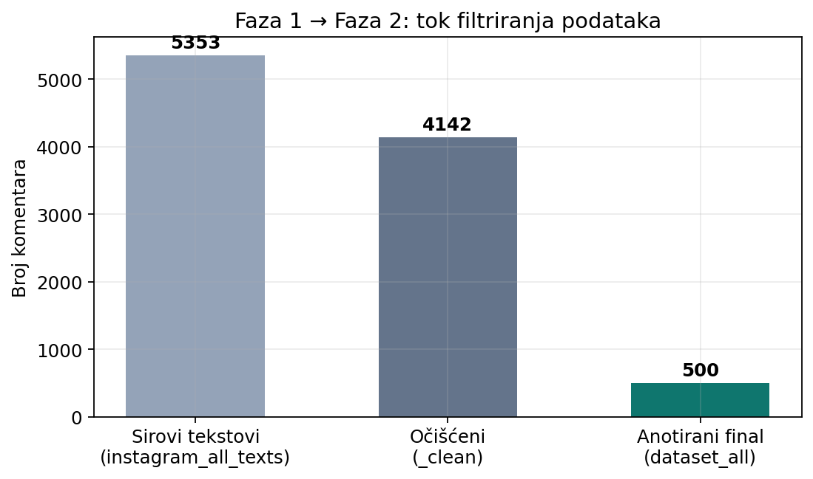
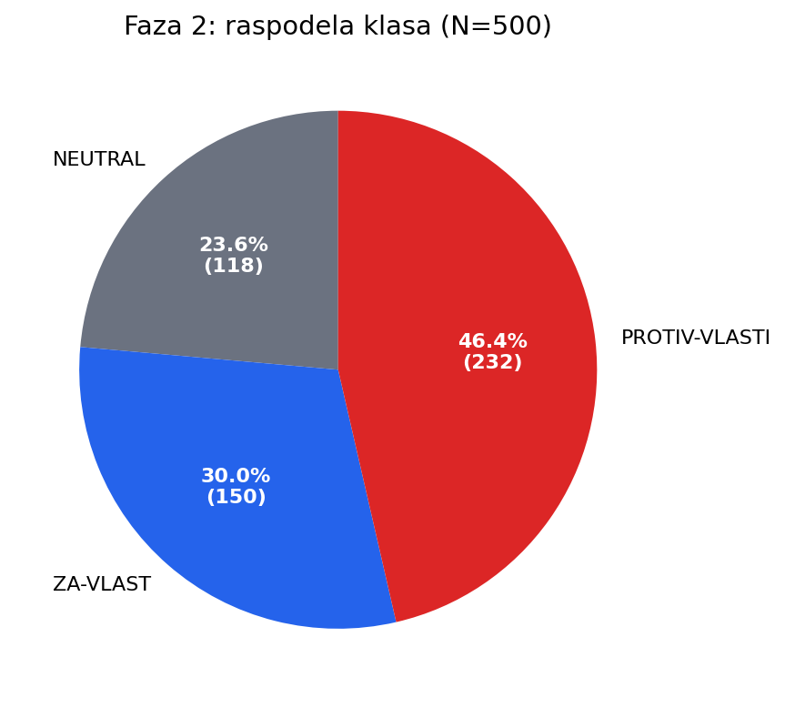
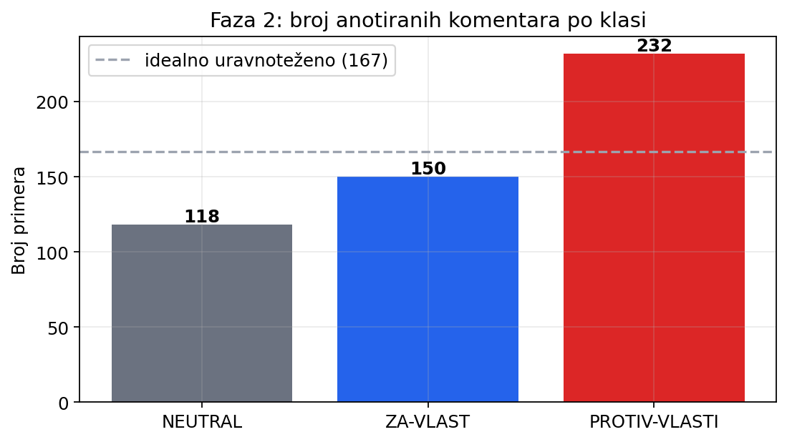
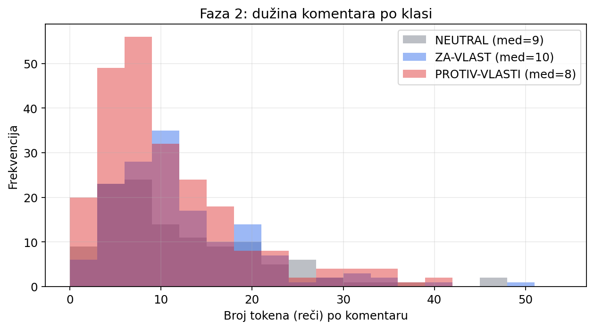
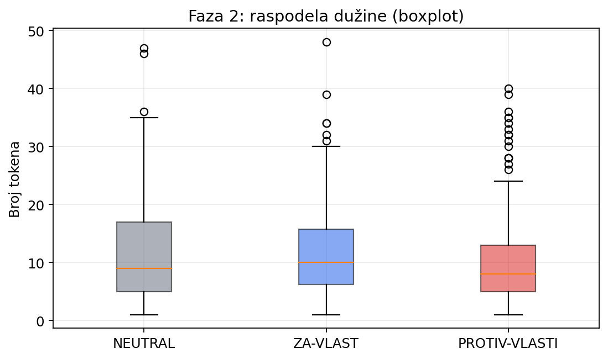
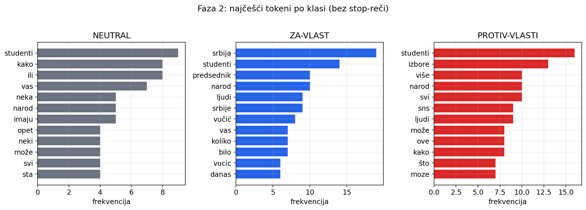

# Analiza podataka — Faza 1 i Faza 2

Izvor: Instagram komentari o studentskim protestima; finalni anotirani skup `dataset_all.txt`.

## 1. Pregled (što smo dobili)

| Etapa | Broj |
|-------|------|
| Instagram objave (unique) | **15** |
| Komentari u exportima (max po objavi) | **5007** |
| `instagram_all_texts.txt` (sa mogućim duplikatima exporta) | **5353** |
| `instagram_all_texts_clean.txt` | **4142** |
| Finalni anotirani skup (Faza 2) | **500** |

Od sirovog ka finalnom: zadržano **9.3%** linija iz `all_texts` (ili **12.1%** od clean skupa) — očekivano, jer se ručno bira kvalitetan, uravnoteženiji podskup za učenje modela.

## 2. Faza 1 — prikupljanje

- Platforma u ovom izveštaju: **Instagram** (pipe `|` TXT + JSON export po objavi).
- Broj jedinstvenih objava: **15**.
- Raspodela komentara po objavi je **jako neuravnotežena** (nekoliko viralnih postova daje većinu komentara).

### Top objave po broju komentara (Faza 1)

| Shortcode | Komentara |
|-----------|-----------|
| `DJSKP8mAFud` | 1574 |
| `DQFJ7-CDWHt` | 1112 |
| `DaVcGdTgKw9` | 538 |
| `DaayFERuBot` | 529 |
| `DUBlHK6Db4n` | 315 |
| `DamwUQSOKZi` | 238 |
| `DaYSnv9AC90` | 195 |
| `DannSAYsHh5` | 111 |
| `Dais6d2gRyJ` | 89 |
| `DaavT5Itdha` | 86 |

## 3. Faza 2 — anotacija

### 3.1 Raspodela klasa

| Klasa | Broj | Udeo |
|-------|------|------|
| `NEUTRAL` | 118 | 23.6% |
| `ZA-VLAST` | 150 | 30.0% |
| `PROTIV-VLASTI` | 232 | 46.4% |

**Neuravnoteženost** (max/min): **1.97×** (`PROTIV-VLASTI` je najveća klasa). Zato u Fazi 3 koristimo **macro-F1**, ne samo accuracy.

### 3.2 Dužina komentara (broj tokena)

| Klasa | n | prosek | medijana | std | p90 | max |
|-------|---|--------|----------|-----|-----|-----|
| `NEUTRAL` | 118 | 11.8 | 9 | 9.1 | 24 | 47 |
| `ZA-VLAST` | 150 | 11.8 | 10 | 7.9 | 21 | 48 |
| `PROTIV-VLASTI` | 232 | 10.4 | 8 | 8.0 | 21 | 40 |

Komentari su uglavnom **kratki** (medijana ~8–10 tokena) — tipično za društvene mreže. Klase su slične po dužini; `PROTIV-VLASTI` je malo kraća u proseku.

### 3.3 Izvori (URL / objava)

- Jedinstvenih URL izvora u anotiranom skupu: **15**
- Redova sa `NEMA` URL: **0**

Anotirani podskup **ne prati** proporciju sirovih komentara 1:1 — biraju se primeri po klasama. Ipak, i u finalu dominiraju neke objave:

### 3.4 Leksički signal (top tokeni)

Najčešći tokeni (grubo, bez stop-reči) daju uvid u to šta model može da „nauči“ preko bag-of-words / TF-IDF:

## 4. Poređenje Faza 1 vs Faza 2

| Dimenzija | Faza 1 | Faza 2 |
|-----------|--------|--------|
| Cilj | što više javnih komentara | kvalitetan **označen** skup |
| Obim | ~5007 (export) / 5353 linija all | **500** primera |
| Oznake | nema | 3 klase |
| URL metapodatak | u export TXT/JSON | u annotated fajlovima |
| Balans klasa | N/A | neuravnotežen (1.97×) |

**Zaključak za modele (Faza 3):**

1. Skup je mali (500) → baseline i enkoder mogu overfittovati; CV je obavezna.
2. Klasa `NEUTRAL` je najmanja i često najteža (nejasan signal).
3. Kratki tekstovi → n-grami i kontekst enkodera pomažu više od dugih dokumenata.
4. Domacija pojedinih objava → oprez od „curenja“ stila jednog thread-a u train/test (stratifikacija po klasi pomaže, ali ne rešava source bias potpuno).

## 5. Fajlovi grafika

- `output/data_analysis/01_funnel_phase1_to_phase2.png`
- `output/data_analysis/02_label_distribution.png`
- `output/data_analysis/03_label_bars.png`
- `output/data_analysis/04_length_by_label.png`
- `output/data_analysis/05_length_boxplot.png`
- `output/data_analysis/06_phase1_comments_per_post.png`
- `output/data_analysis/07_annotated_by_source_stacked.png`
- `output/data_analysis/08_top_tokens_by_label.png`
- `output/data_analysis/09_class_share_top_sources.png`

Numerički rezime: `output/data_analysis/summary.json`
