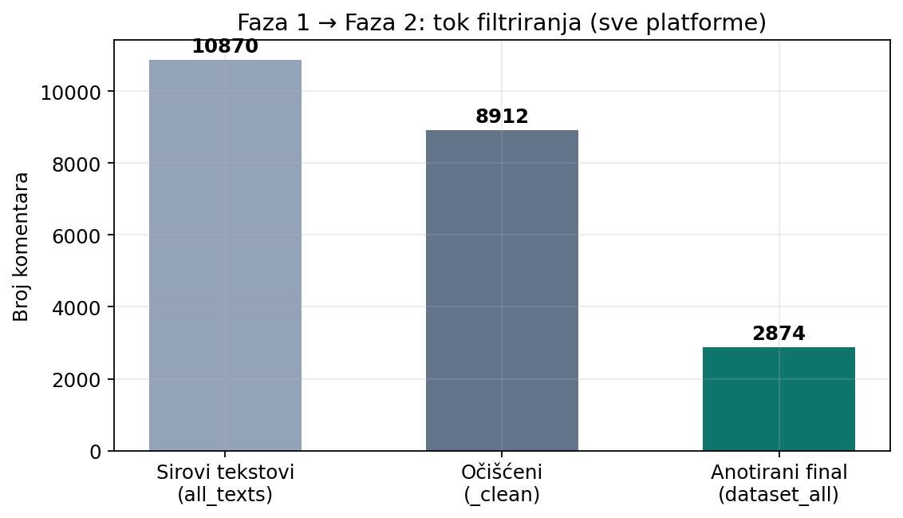
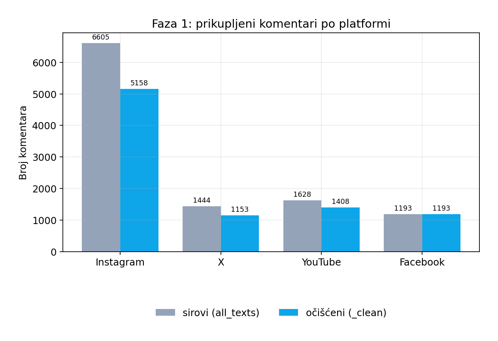
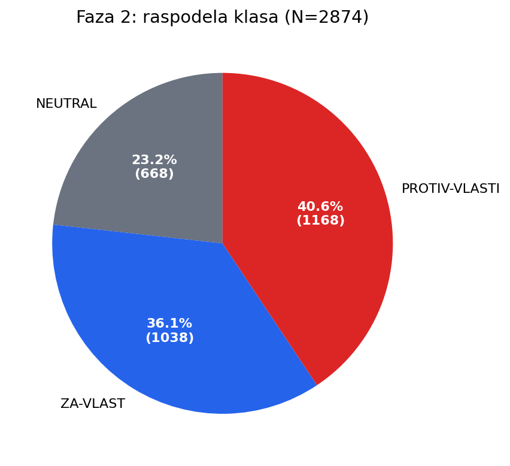
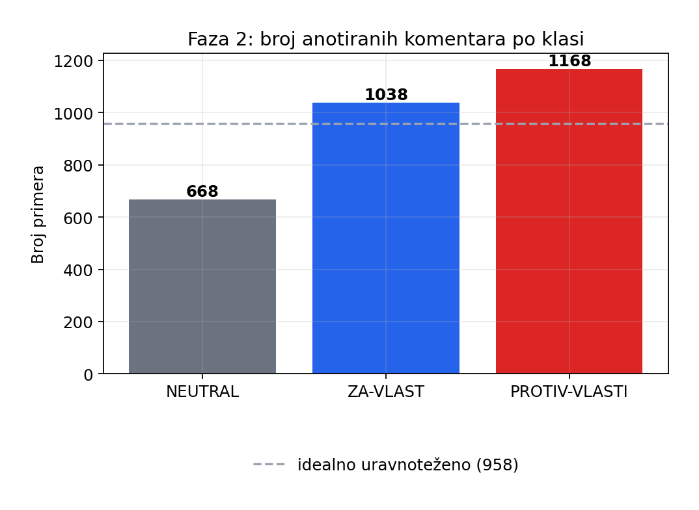
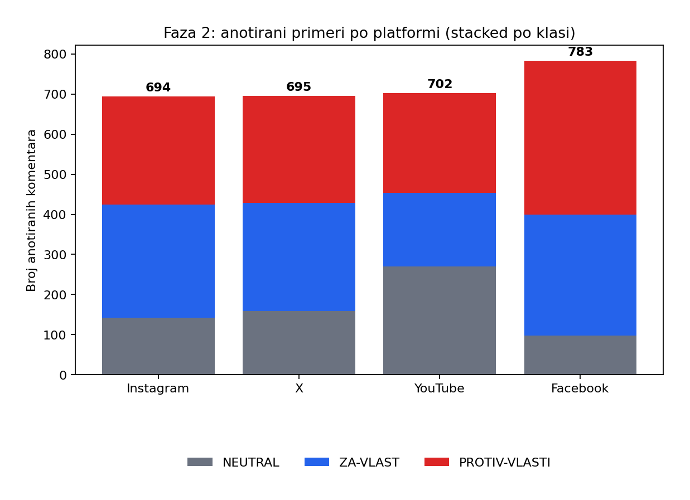
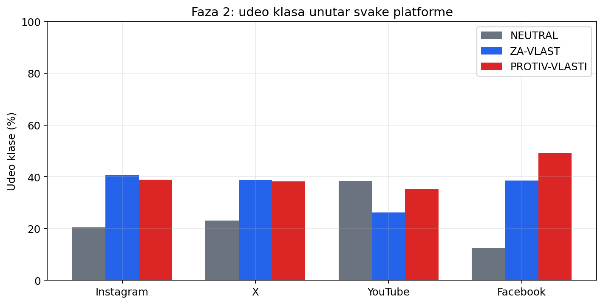
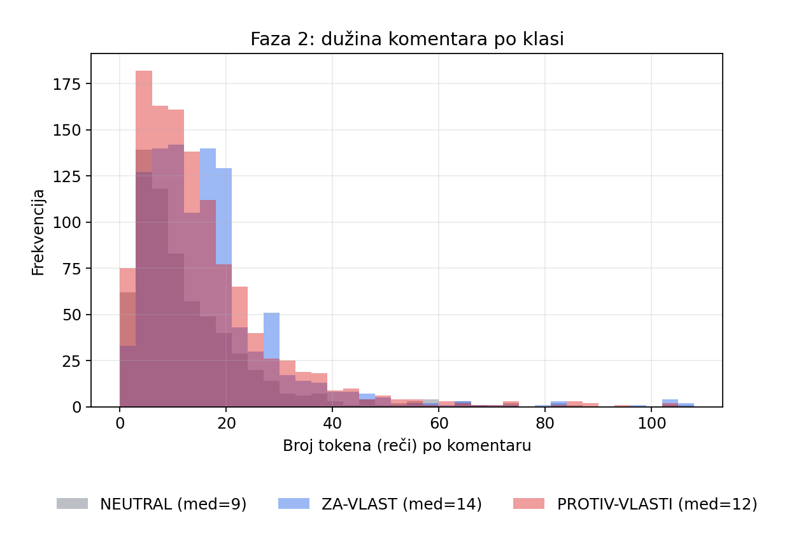
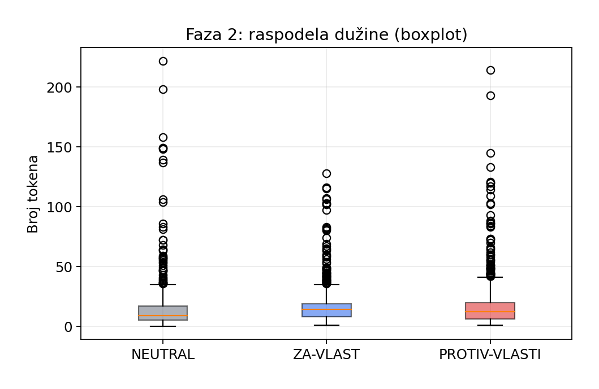
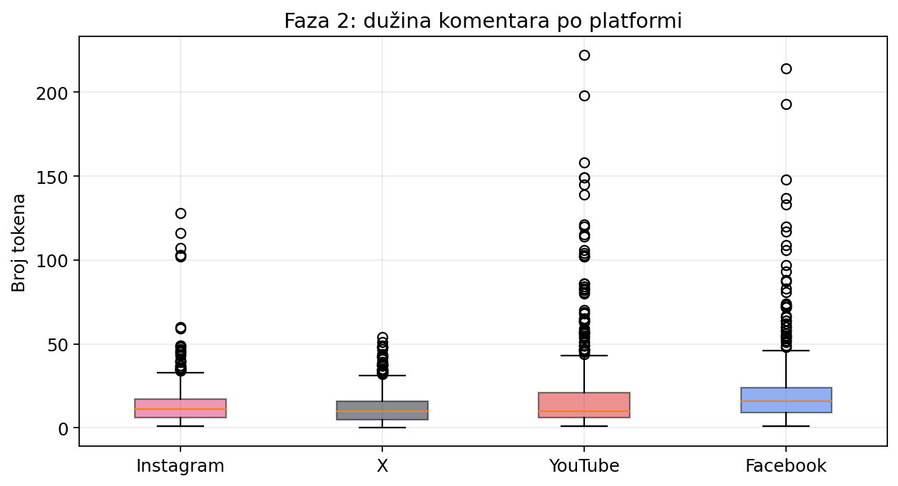
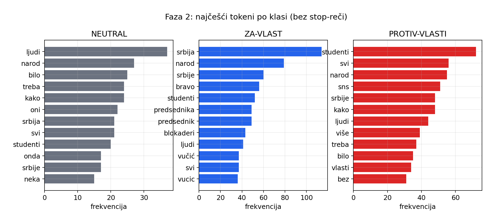

# Analiza podataka — Faza 1 i Faza 2

Izvor: javni komentari o studentskim protestima u Srbiji (Instagram, X, YouTube, Facebook). Finalni anotirani skup: `phase2_annotation/annotated/dataset_all.txt`.

Grafike su u `phase3_model_training/output/data_analysis/` (PNG, spremne za git / izveštaj).

## 1. Pregled

| Etapa | Broj |
|---|---|
| Sirovi tekstovi (sve platforme, `all_texts`) | **10870** |
| Očišćeni tekstovi (`_clean`) | **8912** |
| Finalni anotirani skup (Faza 2) | **2874** |
| Jedinstvenih URL izvora u Fazi 2 | **148** |
| Redova bez URL-a | **5** |

Od sirovog ka finalnom zadržano je **26.4%** linija iz `all_texts` (**32.2%** od clean skupa). To je očekivano: ručno se bira kvalitetan, uravnoteženiji podskup za učenje modela.



## 2. Faza 1 — prikupljanje

Komentari su prikupljeni sa četiri platforme. Broj sirovih linija zavisi od exporta (mogući duplikati pri ponovnom preuzimanju iste objave).

| Platforma | Sirovi | Očišćeni | Jedinstvene objave (export) |
|---|---|---|---|
| Instagram | 6605 | 5158 | 20 |
| X | 1444 | 1153 | 60 |
| YouTube | 1628 | 1408 | 23 |
| Facebook | 1193 | 1193 | 49 |



## 3. Faza 2 — anotacija

### 3.1 Raspodela klasa

| Klasa | Broj | Udeo |
|---|---|---|
| `NEUTRAL` | 668 | 23.2% |
| `ZA-VLAST` | 1038 | 36.1% |
| `PROTIV-VLASTI` | 1168 | 40.6% |

**Neuravnoteženost** (max/min): **1.75×** (najveća `PROTIV-VLASTI`, najmanja `NEUTRAL`). Zato u Fazi 3 koristimo **macro-F1**, ne samo accuracy.





### 3.2 Raspodela po platformi

| Platforma | n | NEUTRAL | ZA-VLAST | PROTIV-VLASTI | Udeo u skupu |
|---|---|---|---|---|---|
| Instagram | 694 | 142 | 282 | 270 | 24.1% |
| X | 690 | 159 | 267 | 264 | 24.0% |
| YouTube | 702 | 270 | 184 | 248 | 24.4% |
| Facebook | 783 | 97 | 302 | 384 | 27.2% |
| Nepoznato | 5 | 0 | 3 | 2 | 0.2% |





### 3.3 Dužina komentara (broj tokena)

| Klasa | n | prosek | medijana | std | p90 | max |
|---|---|---|---|---|---|---|
| `NEUTRAL` | 668 | 14.7 | 9 | 21.3 | 27 | 222 |
| `ZA-VLAST` | 1038 | 16.3 | 14 | 14.5 | 29 | 128 |
| `PROTIV-VLASTI` | 1168 | 15.8 | 12 | 17.7 | 31 | 214 |

Komentari su uglavnom **kratki** (ukupna medijana ≈ 12 tokena) — tipično za društvene mreže. Klase su slične po dužini.







### 3.4 Leksički signal (top tokeni)

Najčešći tokeni (bez stop-reči) pokazuju šta bag-of-words / TF-IDF baseline može da nauči po klasama.



## 4. Zaključak za modele (Faza 3)

1. Skup ima **2874** primera — dovoljno za baseline; enkoder i dalje treba **stratifikovanu CV** da se smanji overfitting.
2. Klasa `NEUTRAL` je najmanja; macro-F1 je prava glavna metrika.
3. Kratki tekstovi → n-grami (baseline) i kontekst enkodera pomažu više od modela rađenih za duge dokumente.
4. Četiri platforme unose različit žargon i dužinu; model treba da generalizuje preko izvora, ne samo unutar jednog threada.

## 5. Fajlovi grafika

- `output/data_analysis/01_funnel_phase1_to_phase2.png`
- `output/data_analysis/02_label_distribution.png`
- `output/data_analysis/03_label_bars.png`
- `output/data_analysis/04_length_by_label.png`
- `output/data_analysis/05_length_boxplot.png`
- `output/data_analysis/06_phase1_by_platform.png`
- `output/data_analysis/07_annotated_by_platform_stacked.png`
- `output/data_analysis/08_top_tokens_by_label.png`
- `output/data_analysis/09_class_share_by_platform.png`
- `output/data_analysis/10_length_by_platform.png`

Numerički rezime: `output/data_analysis/summary.json`

Regenerisanje:

```bash
cd phase3_model_training
python analyze_phase1_phase2.py
```
