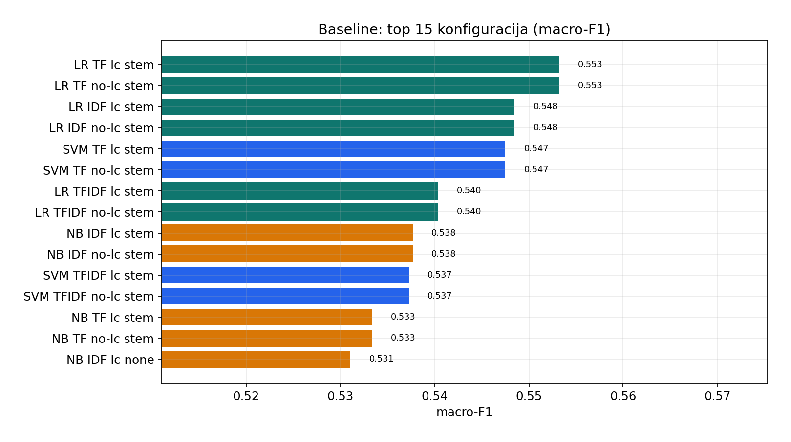
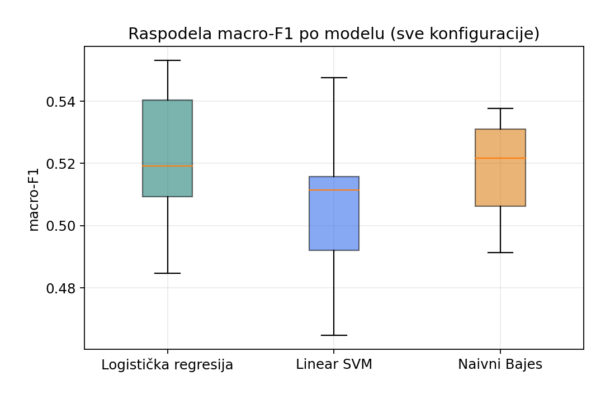
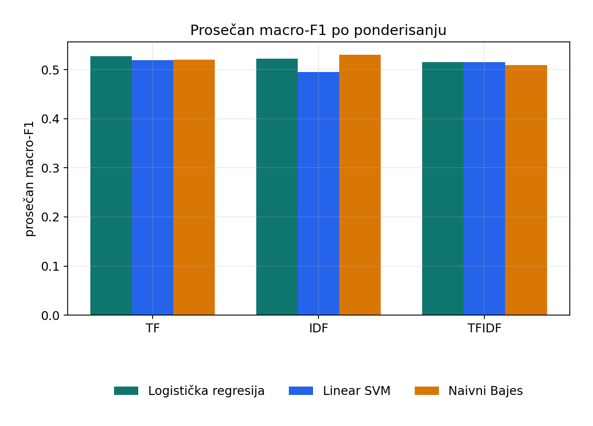
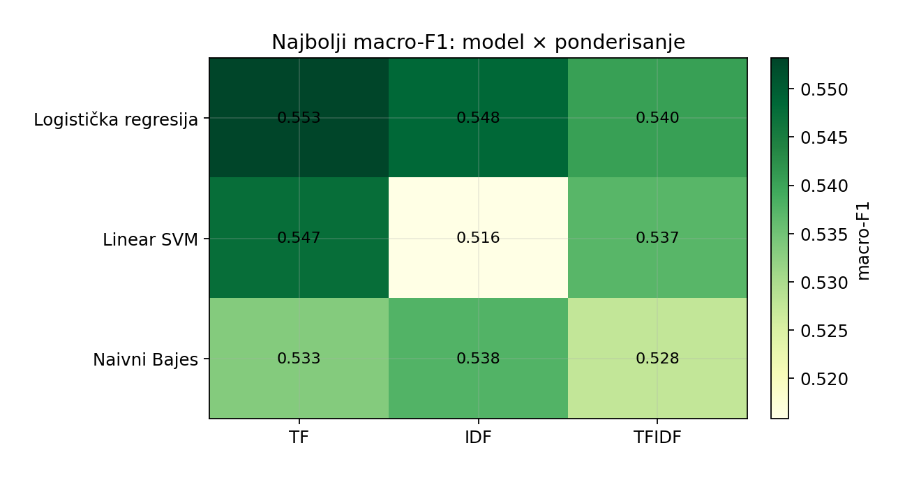
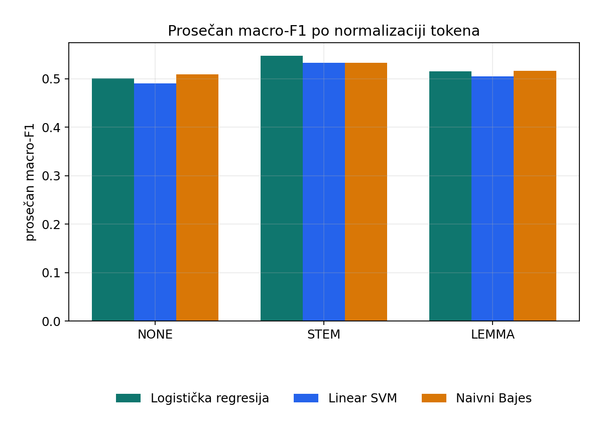
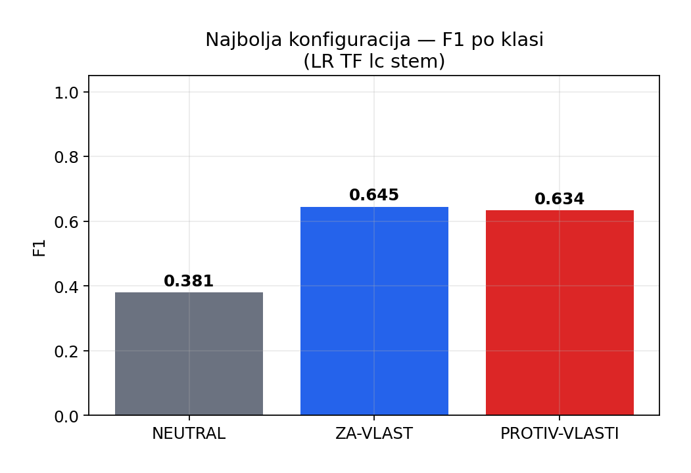
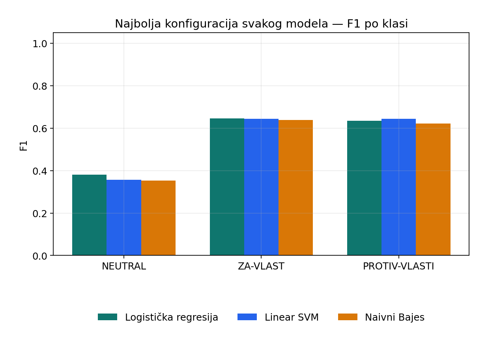

# Baseline izveštaj (Faza 3.1)

Klasični modeli: logistička regresija, linear SVM, multinomialni naivni Bajes. Eksperimentalni faktori: ponderisanje (**TF / IDF / TF-IDF**), **lowercasing**, normalizacija tokena (**none / stem / lemma**). Evaluacija: ugnežđena stratifikovana unakrsna validacija, glavna metrika **macro-F1**.

## 1. Postavka

| Stavka | Vrednost |
|---|---|
| Skup | `dataset_all.txt` |
| Broj primera | 2874 |
| Klase | NEUTRAL=668, ZA-VLAST=1038, PROTIV-VLASTI=1168 |
| Spoljašnji foldovi | 10 |
| Unutrašnji foldovi (hiperparametri) | 3 |
| Broj konfiguracija | 54 |
| Hiperparametri LR/SVM | [0.1, 1.0, 10.0] |
| Hiperparametri NB (alpha) | [0.1, 0.5, 1.0] |

TF/IDF/TF-IDF, lowercasing, stem i lemma su tehnike pretprocesiranja; nijedna nije podrazumevani 'default model'.

## 2. Najbolji rezultat

**Pobednik:** `LR TF lc stem`

| Metrika | Vrednost |
|---|---|
| macro-F1 | **0.5532** |
| accuracy | 0.5825 |
| weighted-F1 | 0.5791 |
| Najbolji hiperparametri | {'clf__C': 1.0} |
| F1 `NEUTRAL` | 0.3806 |
| F1 `ZA-VLAST` | 0.6451 |
| F1 `PROTIV-VLASTI` | 0.6340 |

Najslabija konfiguracija: `SVM IDF no-lc none` (macro-F1=0.4646). Raspon: **0.089** poena macro-F1.



## 3. Top 10 konfiguracija

| # | Model | Ponder | Lowercase | Norm | macro-F1 | acc | F1 NEUTRAL | F1 ZA-VLAST | F1 PROTIV |
|---|---|---|---|---|---|---|---|---|---|
| 1 | LR | TF | da | stem | 0.5532 | 0.5825 | 0.381 | 0.645 | 0.634 |
| 2 | LR | TF | ne | stem | 0.5532 | 0.5825 | 0.381 | 0.645 | 0.634 |
| 3 | LR | IDF | da | stem | 0.5485 | 0.5734 | 0.390 | 0.637 | 0.619 |
| 4 | LR | IDF | ne | stem | 0.5485 | 0.5734 | 0.390 | 0.637 | 0.619 |
| 5 | SVM | TF | da | stem | 0.5475 | 0.5846 | 0.356 | 0.643 | 0.643 |
| 6 | SVM | TF | ne | stem | 0.5475 | 0.5846 | 0.356 | 0.643 | 0.643 |
| 7 | LR | TFIDF | da | stem | 0.5404 | 0.5800 | 0.345 | 0.635 | 0.641 |
| 8 | LR | TFIDF | ne | stem | 0.5404 | 0.5800 | 0.345 | 0.635 | 0.641 |
| 9 | NB | IDF | da | stem | 0.5377 | 0.5682 | 0.353 | 0.639 | 0.622 |
| 10 | NB | IDF | ne | stem | 0.5377 | 0.5682 | 0.353 | 0.639 | 0.622 |

## 4. Uticaj faktora (prosečan macro-F1)

### 4.1 Model

| Model | Prosečan macro-F1 | Najbolji macro-F1 |
|---|---|---|
| Logistička regresija | 0.5215 | 0.5532 |
| Linear SVM | 0.5096 | 0.5475 |
| Naivni Bajes | 0.5197 | 0.5377 |



### 4.2 Ponderisanje (TF / IDF / TF-IDF)

| Ponder | Prosečan macro-F1 |
|---|---|
| TF | 0.5217 |
| IDF | 0.5158 |
| TFIDF | 0.5132 |





### 4.3 Normalizacija tokena

| Normalizacija | Prosečan macro-F1 |
|---|---|
| none | 0.5004 |
| stem | 0.5379 |
| lemma | 0.5125 |



### 4.4 Lowercasing

| Lowercasing | Prosečan macro-F1 |
|---|---|
| uključen | 0.5210 |
| isključen | 0.5129 |

## 5. F1 po klasi





Najbolja konfiguracija po modelu:

| Model | Konfiguracija | macro-F1 | acc |
|---|---|---|---|
| Logistička regresija | LR TF lc stem | 0.5532 | 0.5825 |
| Linear SVM | SVM TF lc stem | 0.5475 | 0.5846 |
| Naivni Bajes | NB IDF lc stem | 0.5377 | 0.5682 |

## 6. Zaključak za izveštaj

- Od **54** isprobanih konfiguracija najbolja je **Logistička regresija** sa **TF**, normalize=`stem`, lowercase=da (macro-F1 = **0.553**, acc = 0.582).
- Najteža klasa po F1 kod pobednika: **NEUTRAL** (0.381).
- TF-IDF nije unapred proglašen pobednikom: upoređeni su TF, IDF i TF-IDF ravnopravno.
- Ove brojke su **donja granica** za Fazu 3; enkoder (BERTić / mBERT) treba da ih nadmaši po macro-F1.

## 7. Fajlovi

- Sirovi rezultati: `baseline/output/baseline_results.json`
- Classification report-i: `baseline/output/baseline_results.txt`
- `output/baseline_analysis/01_ranking_macro_f1.png`
- `output/baseline_analysis/02_f1_by_model.png`
- `output/baseline_analysis/03_f1_by_weighting.png`
- `output/baseline_analysis/04_f1_by_normalize.png`
- `output/baseline_analysis/05_heatmap_model_weighting.png`
- `output/baseline_analysis/06_best_per_class_f1.png`
- `output/baseline_analysis/07_best_model_per_class.png`

Regenerisanje (kad postoji JSON):

```bash
cd phase3_model_training
python baseline/report_baseline.py
```
