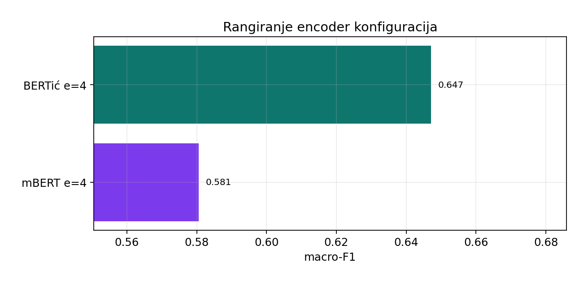

# Enkoder izveštaj (Faza 3.2a)

Fine-tuning preko Hugging Face Trainer: **BERTić** (`classla/bcms-bertic`) i **mBERT** (`bert-base-multilingual-cased`). Evaluacija: stratifikovana **k-fold** unakrsna validacija; glavna metrika **macro-F1**. Posle CV-a svaki model se trenira na celom skupu i čuva u odvojenom folderu za inferencu.

## 1. Postavka

| Stavka | Vrednost |
|---|---|
| Skup | `dataset_all.txt` |
| Broj primera | 2874 |
| Klase | NEUTRAL=668, ZA-VLAST=1038, PROTIV-VLASTI=1168 |
| Foldovi (CV) | 10 |
| Batch size | 8 |
| Learning rate | 2e-05 |
| Max length | 128 |
| Uređaj | cuda |
| Broj konfiguracija | 2 |

## 2. Ko je bolji?

**Pobednik (macro-F1):** **BERTić** (epochs=4, macro-F1 = **0.6471**, acc = 0.6681).

| Model | epochs | macro-F1 | acc | weighted-F1 | folder |
|---|---|---|---|---|---|
| BERTić | 4 | 0.6471 | 0.6681 | 0.6662 | `encoder_bertic` |
| mBERT | 4 | 0.5805 | 0.6006 | 0.5993 | `encoder_mbert` |

Razlika macro-F1 (BERTić − mBERT): **0.0665**.




## 3. F1 po klasi


| Model | F1 NEUTRAL | F1 ZA-VLAST | F1 PROTIV-VLASTI |
|---|---|---|---|
| BERTić | 0.5137 | 0.7371 | 0.6904 |
| mBERT | 0.4498 | 0.6689 | 0.6229 |

## 4. Stabilnost po foldovima


| Model | mean fold macro-F1 | std | min | max |
|---|---|---|---|---|
| BERTić | 0.6474 | 0.0290 | 0.5965 | 0.6970 |
| mBERT | 0.5805 | 0.0230 | 0.5447 | 0.6161 |

## 5. Matrice konfuzije


## 6. Zaključak za izveštaj

- Pobednik po macro-F1: **BERTić** (epochs=4, macro-F1=**0.647**).
- Najteža klasa kod pobednika: **NEUTRAL**.
- Oba modela su sačuvana u odvojenim folderima; inferenca radi nezavisno.

## 7. Fajlovi i inferenca

- Sirovi rezultati: `C:/Users/korisnik/Desktop/Ana Bulatovic/opj/nlp-student-protest-stance-classification/phase3_model_training/encoder/output/encoder_results_compare_e4.json`
- Classification report-i: uz JSON (`.txt`)
- Modeli:
  - `C:\Users\korisnik\Desktop\Ana Bulatovic\opj\nlp-student-protest-stance-classification\phase3_model_training\encoder\output\encoder_bertic`
  - `C:\Users\korisnik\Desktop\Ana Bulatovic\opj\nlp-student-protest-stance-classification\phase3_model_training\encoder\output\encoder_mbert`

```bash
cd phase3_model_training
python encoder/infer_encoder.py --model bertic -t "Pumpaj!"
python encoder/infer_encoder.py --model mbert -t "Pumpaj!"
python encoder/report_encoder.py
```

- `output/encoder_analysis/01_compare_metrics.png`
- `output/encoder_analysis/02_per_class_f1.png`
- `output/encoder_analysis/03_fold_macro_f1.png`
- `output/encoder_analysis/04_cm_bertic.png`
- `output/encoder_analysis/05_cm_mbert.png`
- `output/encoder_analysis/06_ranking_macro_f1.png`
