# Enkoder izveštaj (Faza 3.2a)

Fine-tuning preko Hugging Face Trainer: **BERTić** (`classla/bcms-bertic`) i **mBERT** (`bert-base-multilingual-cased`). Evaluacija: stratifikovana **k-fold** unakrsna validacija; glavna metrika **macro-F1**. Posle CV-a svaki model se trenira na celom skupu i čuva u odvojenom folderu za inferencu.

## 1. Postavka

| Stavka | Vrednost |
|---|---|
| Skup | `dataset_all.txt` |
| Broj primera | 2874 |
| Klase | NEUTRAL=668, ZA-VLAST=1038, PROTIV-VLASTI=1168 |
| Foldovi (CV) | 10 |
| Batch size | 32 |
| Learning rate | 2e-05 |
| Max length | 128 |
| Uređaj | cuda |
| Broj konfiguracija | 4 |

## 2. Ko je bolji?

**Pobednik (macro-F1):** **BERTić + class weights** (epochs=5, macro-F1 = **0.6374**, acc = 0.6479).

| Model | epochs | macro-F1 | acc | weighted-F1 | folder |
|---|---|---|---|---|---|
| BERTić | 5 | 0.6296 | 0.6514 | 0.6483 | `encoder_bertic` |
| BERTić + class weights | 5 | 0.6374 | 0.6479 | 0.6499 | `encoder_bertic` |
| mBERT | 5 | 0.5770 | 0.5967 | 0.5952 | `encoder_mbert` |
| mBERT + class weights | 5 | 0.5640 | 0.5755 | 0.5780 | `encoder_mbert` |

Razlika macro-F1 (BERTić + class weights − BERTić): **0.0078**.

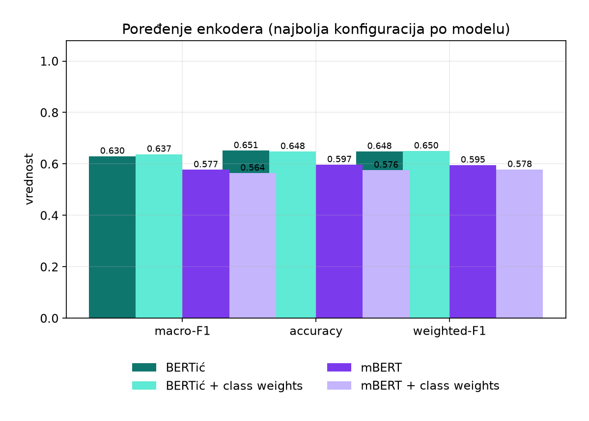

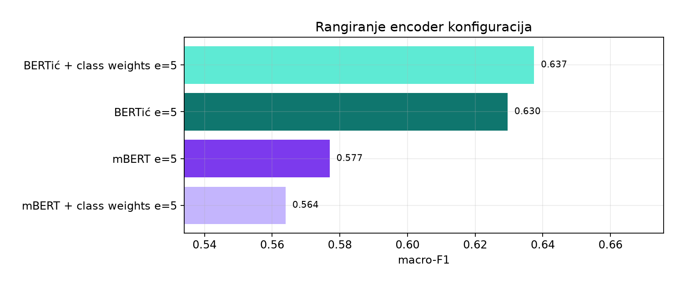

## 3. F1 po klasi

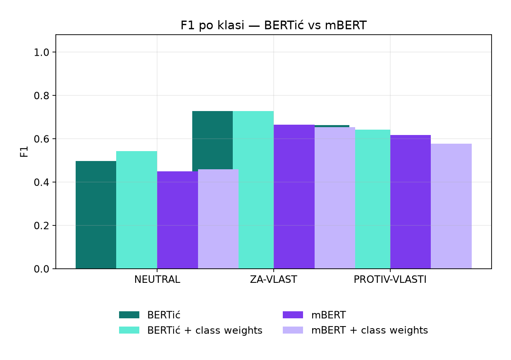

| Model | F1 NEUTRAL | F1 ZA-VLAST | F1 PROTIV-VLASTI |
|---|---|---|---|
| BERTić | 0.4964 | 0.7285 | 0.6639 |
| BERTić + class weights | 0.5425 | 0.7270 | 0.6428 |
| mBERT | 0.4498 | 0.6641 | 0.6171 |
| mBERT + class weights | 0.4597 | 0.6543 | 0.5779 |

## 4. Stabilnost po foldovima

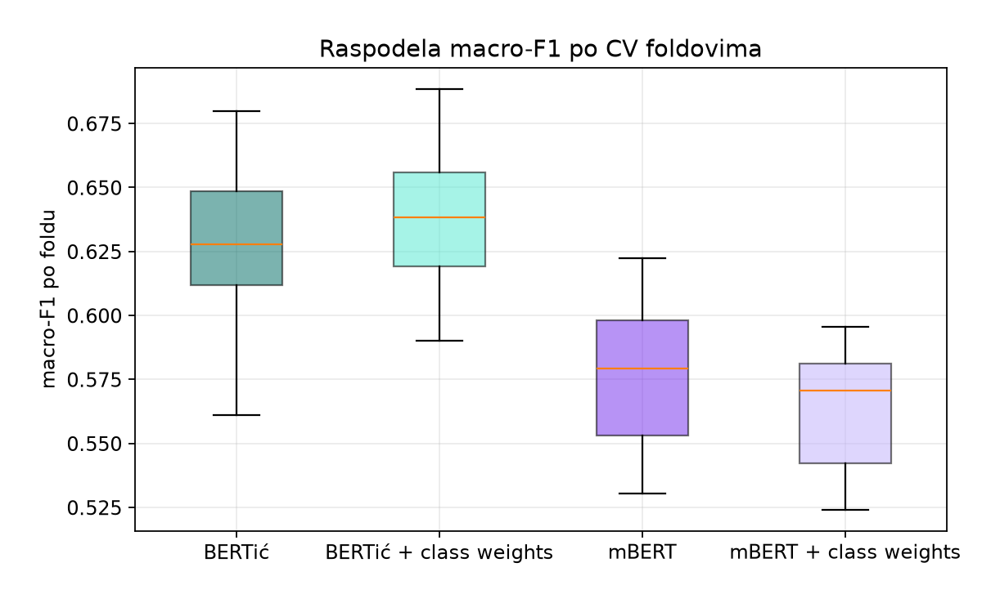

| Model | mean fold macro-F1 | std | min | max |
|---|---|---|---|---|
| BERTić | 0.6280 | 0.0330 | 0.5612 | 0.6797 |
| BERTić + class weights | 0.6376 | 0.0277 | 0.5902 | 0.6886 |
| mBERT | 0.5764 | 0.0296 | 0.5305 | 0.6224 |
| mBERT + class weights | 0.5630 | 0.0242 | 0.5241 | 0.5954 |

## 5. Uticaj broja epoha

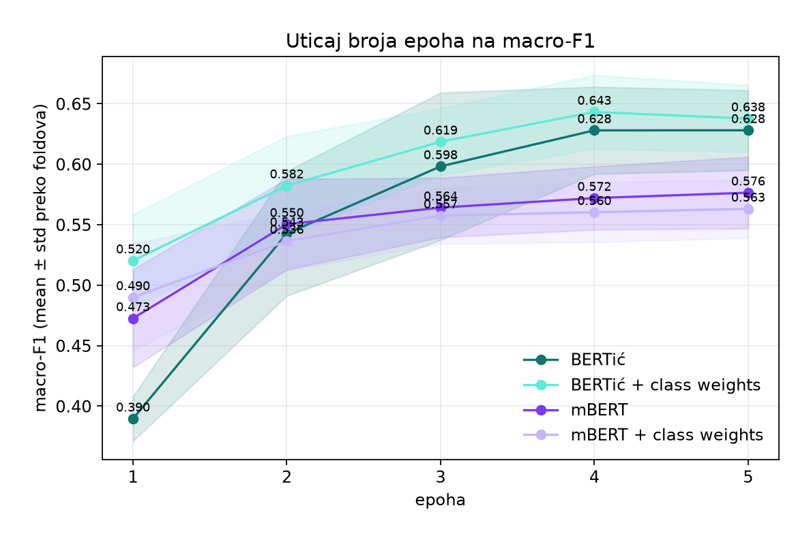

| Epoha | macro-F1 (mean) | std | min | max |
|---|---|---|---|---|
| 1 | 0.3895 | 0.0185 | 0.3625 | 0.4203 |
| 2 | 0.5426 | 0.0515 | 0.4338 | 0.6152 |
| 3 | 0.5982 | 0.0609 | 0.4341 | 0.6716 |
| 4 | 0.6279 | 0.0360 | 0.5431 | 0.6781 |
| 5 | 0.6280 | 0.0330 | 0.5612 | 0.6797 |

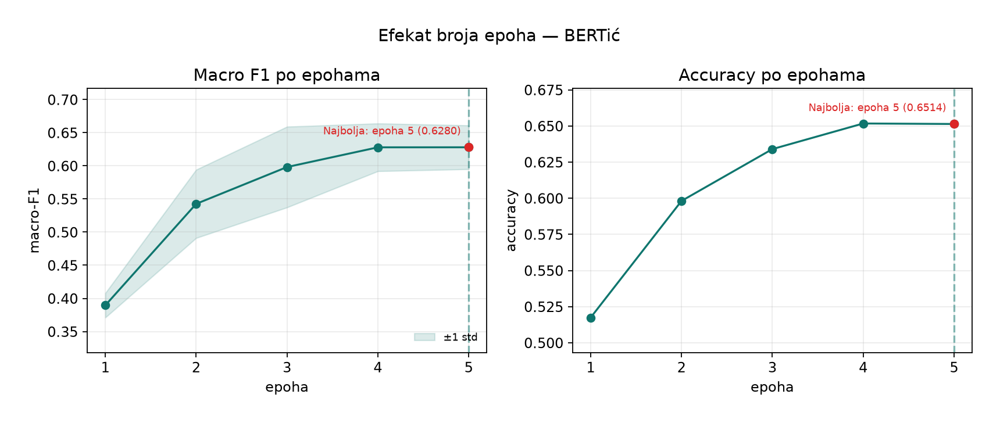

**BERTić**: macro-F1 ide sa 0.3895 (epoha 1) na 0.6280 (epoha 5); između poslednje dve epohe rast značajno usporava (zaravnjuje se) (Δ=+0.0001, naspram Δ=+0.1531 između prve dve).

| Epoha | macro-F1 (mean) | std | min | max |
|---|---|---|---|---|
| 1 | 0.5202 | 0.0383 | 0.4706 | 0.5919 |
| 2 | 0.5823 | 0.0408 | 0.5392 | 0.6501 |
| 3 | 0.6185 | 0.0277 | 0.5614 | 0.6621 |
| 4 | 0.6431 | 0.0305 | 0.5797 | 0.6976 |
| 5 | 0.6377 | 0.0277 | 0.5902 | 0.6886 |

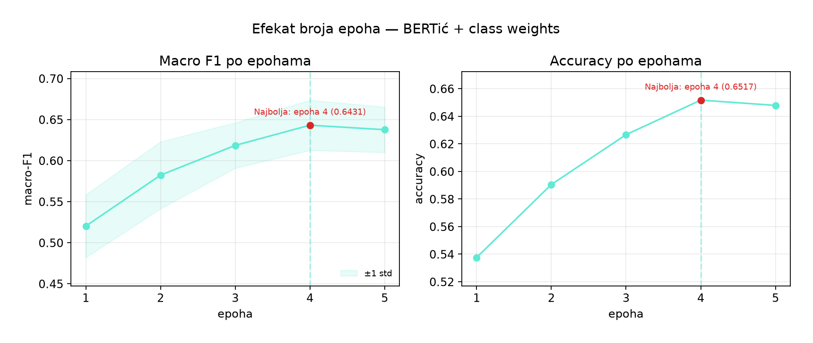

**BERTić + class weights**: macro-F1 ide sa 0.5202 (epoha 1) na 0.6377 (epoha 5); između poslednje dve epohe rast značajno usporava (zaravnjuje se) (Δ=-0.0055, naspram Δ=+0.0620 između prve dve).

| Epoha | macro-F1 (mean) | std | min | max |
|---|---|---|---|---|
| 1 | 0.4725 | 0.0405 | 0.3604 | 0.5061 |
| 2 | 0.5503 | 0.0375 | 0.4694 | 0.5973 |
| 3 | 0.5640 | 0.0246 | 0.5184 | 0.5940 |
| 4 | 0.5719 | 0.0261 | 0.5227 | 0.6078 |
| 5 | 0.5764 | 0.0296 | 0.5305 | 0.6224 |

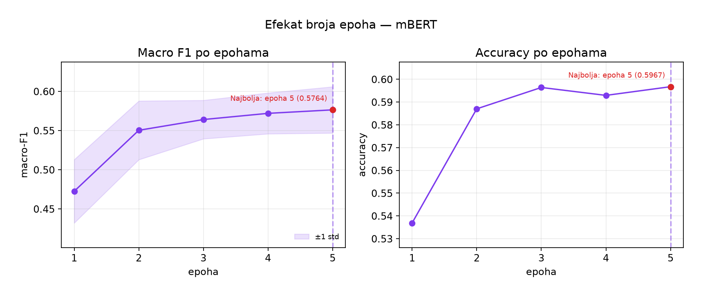

**mBERT**: macro-F1 ide sa 0.4725 (epoha 1) na 0.5764 (epoha 5); između poslednje dve epohe rast značajno usporava (zaravnjuje se) (Δ=+0.0045, naspram Δ=+0.0778 između prve dve).

| Epoha | macro-F1 (mean) | std | min | max |
|---|---|---|---|---|
| 1 | 0.4899 | 0.0441 | 0.4231 | 0.5580 |
| 2 | 0.5365 | 0.0244 | 0.4966 | 0.5839 |
| 3 | 0.5574 | 0.0233 | 0.5123 | 0.5887 |
| 4 | 0.5603 | 0.0248 | 0.5203 | 0.6014 |
| 5 | 0.5630 | 0.0242 | 0.5241 | 0.5954 |

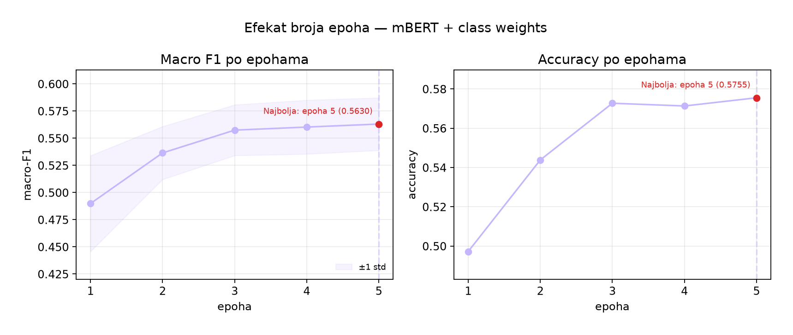

**mBERT + class weights**: macro-F1 ide sa 0.4899 (epoha 1) na 0.5630 (epoha 5); između poslednje dve epohe rast značajno usporava (zaravnjuje se) (Δ=+0.0028, naspram Δ=+0.0466 između prve dve).

Konačan broj epoha korišćen za finalni model: **5**. Manji broj epoha ne bi dao modelu dovoljno vremena da se prilagodi zadatku; veći broj, prema krivoj iznad, donosi sve manje poboljšanje uz veći rizik od preobučavanja (overfitting) i duže treniranje.

## 6. Matrice konfuzije


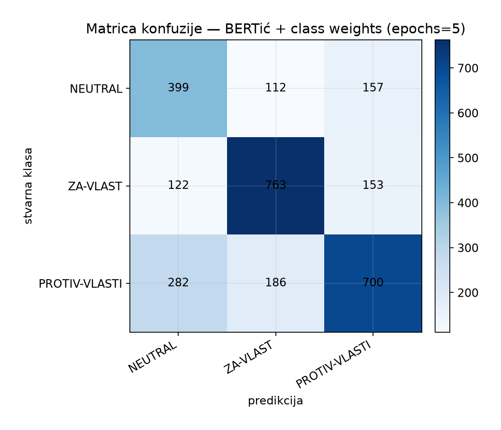

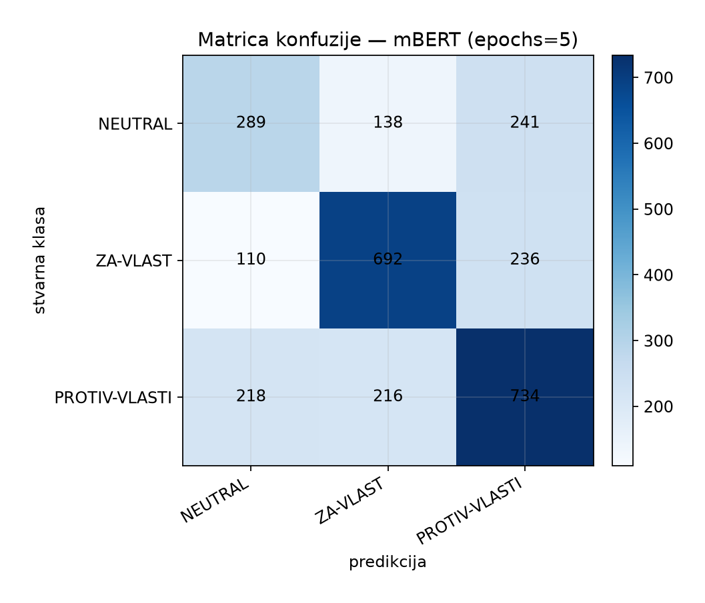


## 7. Zaključak za izveštaj

- Pobednik po macro-F1: **BERTić + class weights** (epochs=5, macro-F1=**0.637**).
- Najteža klasa kod pobednika: **NEUTRAL**.
- Oba modela su sačuvana u odvojenim folderima; inferenca radi nezavisno.

## 8. Fajlovi i inferenca

- Sirovi rezultati: `D:/fakultet/master/OPJ/projekat/output/encoder_results_compare_e5.json; D:/fakultet/master/OPJ/projekat/output_class_weighted/output/encoder_results_compare_e5.json`
- Classification report-i: uz JSON (`.txt`)
- Modeli:
  - `C:\repos\OPJ\nlp-student-protest-stance-classification-3090_params\nlp-student-protest-stance-classification-3090_params\phase3_model_training\encoder\output\encoder_bertic`
  - `C:\repos\OPJ\nlp-student-protest-stance-classification-3090_params\nlp-student-protest-stance-classification-3090_params\phase3_model_training\encoder\output\encoder_bertic`
  - `C:\repos\OPJ\nlp-student-protest-stance-classification-3090_params\nlp-student-protest-stance-classification-3090_params\phase3_model_training\encoder\output\encoder_mbert`
  - `C:\repos\OPJ\nlp-student-protest-stance-classification-3090_params\nlp-student-protest-stance-classification-3090_params\phase3_model_training\encoder\output\encoder_mbert`

```bash
cd phase3_model_training
python encoder/infer_encoder.py --model bertic -t "Pumpaj!"
python encoder/infer_encoder.py --model mbert -t "Pumpaj!"
python encoder/report_encoder.py
```

- `output/encoder_analysis_class_weights_compare/01_compare_metrics.png`
- `output/encoder_analysis_class_weights_compare/02_per_class_f1.png`
- `output/encoder_analysis_class_weights_compare/03_fold_macro_f1.png`
- `output/encoder_analysis_class_weights_compare/05_cm_bertic.png`
- `output/encoder_analysis_class_weights_compare/05_cm_bertic_cw.png`
- `output/encoder_analysis_class_weights_compare/05_cm_mbert.png`
- `output/encoder_analysis_class_weights_compare/05_cm_mbert_cw.png`
- `output/encoder_analysis_class_weights_compare/07_epoch_curve.png`
- `output/encoder_analysis_class_weights_compare/08_epoch_detail_bertic.png`
- `output/encoder_analysis_class_weights_compare/08_epoch_detail_bertic_cw.png`
- `output/encoder_analysis_class_weights_compare/08_epoch_detail_mbert.png`
- `output/encoder_analysis_class_weights_compare/08_epoch_detail_mbert_cw.png`
- `output/encoder_analysis_class_weights_compare/06_ranking_macro_f1.png`
