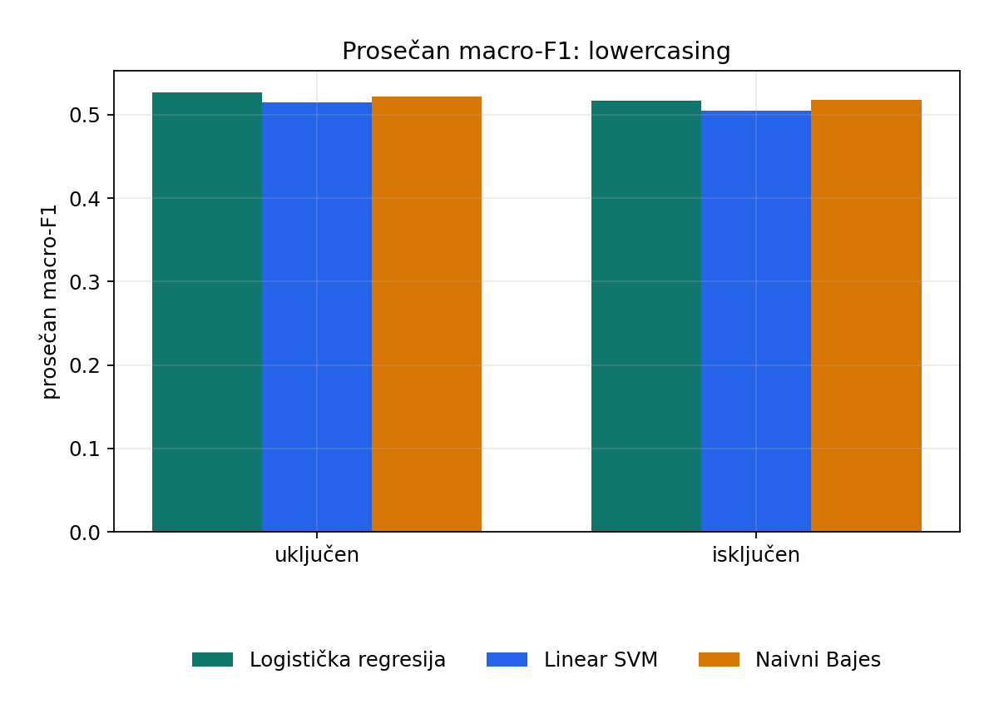
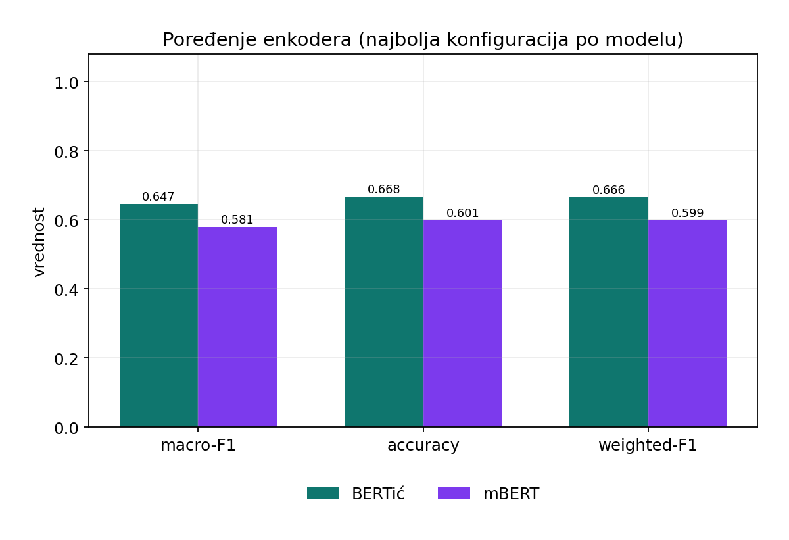
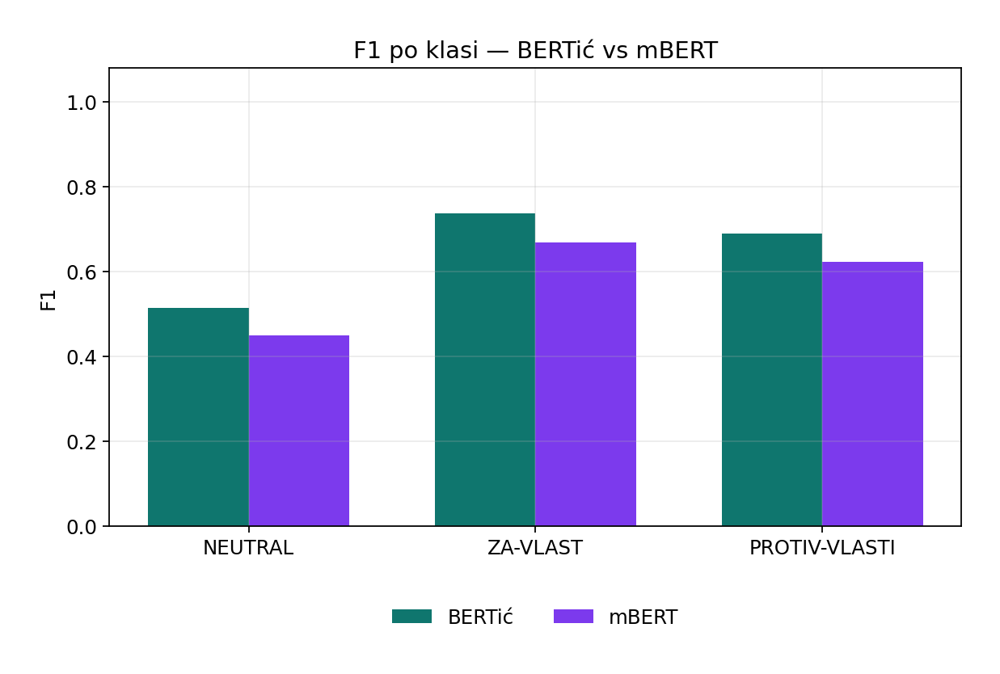
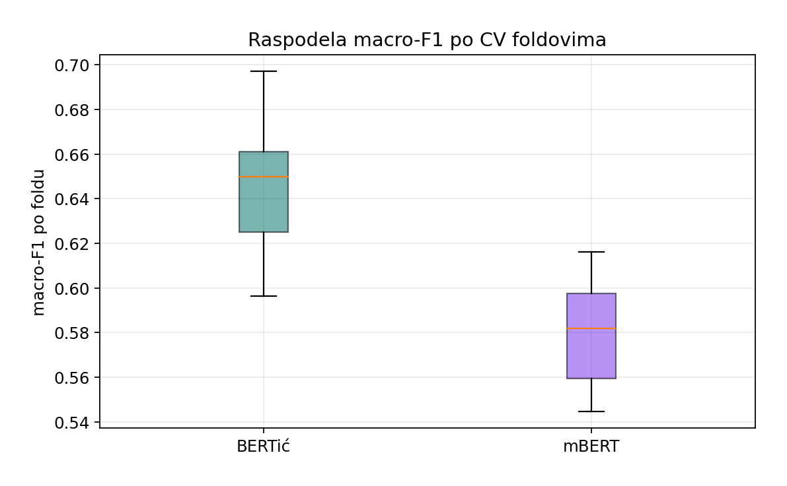
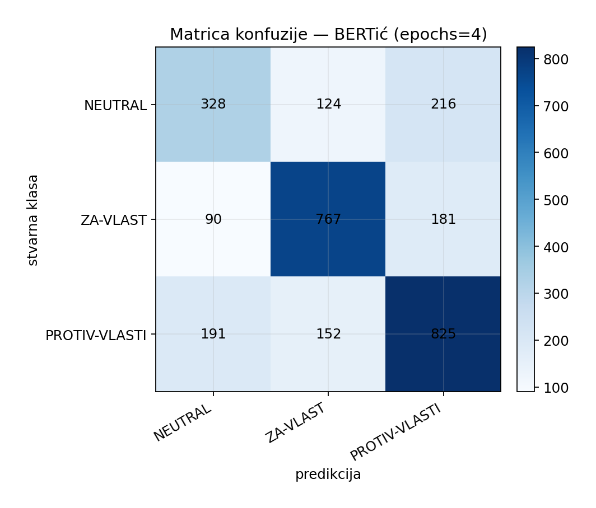
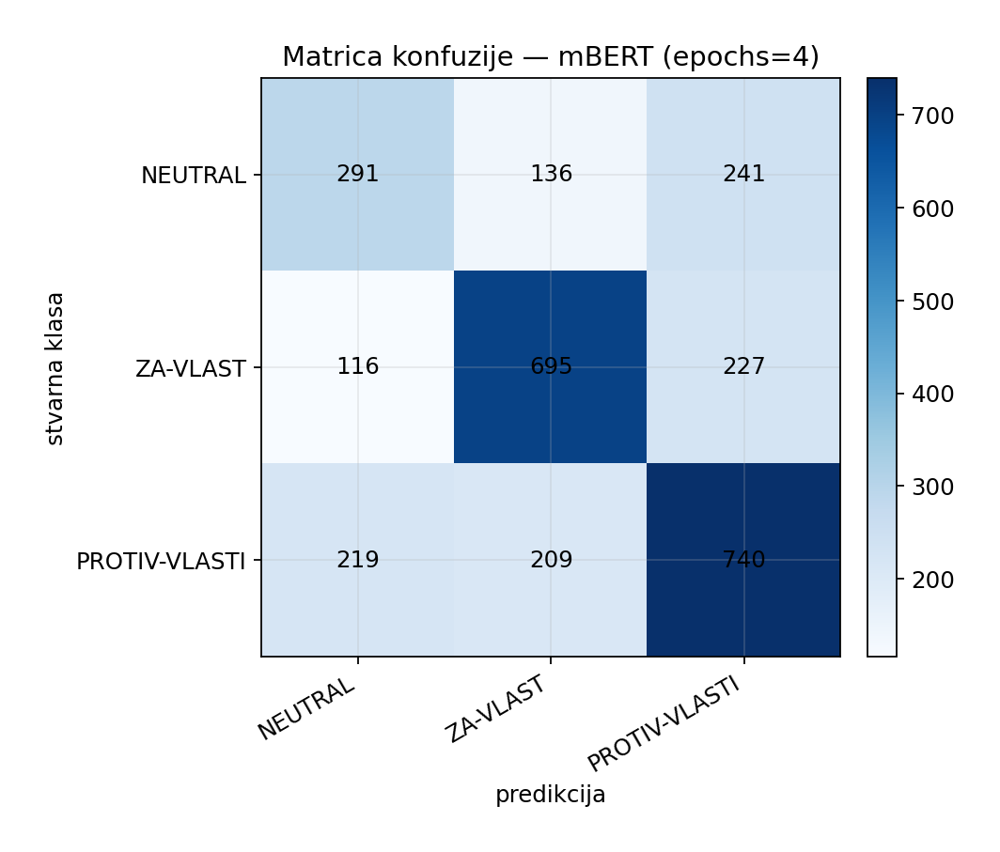

# Фаза 3 — Извештај: обучавање и евалуација модела

Stance класификација коментара о студентским протестима у три класе:
`NEUTRAL`, `ZA-VLAST`, `PROTIV-VLASTI`.

Овај документ је **главни текст за извештај** Фазе 3 (baseline + енкодер).
Аутоматски генерисани детаљи:

- анализа података: [`ANALIZA_FAZA1_FAZA2.md`](ANALIZA_FAZA1_FAZA2.md)
- baseline табеле/графике: [`BASELINE_IZVESTAJ.md`](BASELINE_IZVESTAJ.md)
- енкодер табеле/графике: [`ENCODER_IZVESTAJ.md`](ENCODER_IZVESTAJ.md) *(после `train_encoder.py --compare`)*

---

## 3. Обучавање и евалуација модела

### 3.0 Задатак, подаци и метрике

**Задатак.** За дати коментар са друштвених мрежа предвидети став (stance) према власти / протесту у једној од три класе.

**Скуп.** Финални анотирани скуп `phase2_annotation/annotated/dataset_all.txt`:

| Ставка | Вредност |
|---|---|
| Број примера | **2874** |
| `NEUTRAL` | 668 (23.2%) |
| `ZA-VLAST` | 1038 (36.1%) |
| `PROTIV-VLASTI` | 1168 (40.6%) |
| Платформе | Instagram, X, YouTube, Facebook |

Скуп је **неуравнотежен** (max/min ≈ 1.75×). Зато је главна метрика за поређење модела **macro-F1** (просек F1 по класама), а не само accuracy. Уз macro-F1 пријављујемо и accuracy, weighted-F1 и F1 по класама.

**Ток Фазе 3.**

1. **Baseline** (класични ML) — доња граница перформанси  
2. **Енкодер** (BERTić, mBERT) — fine-tuning Transformer модела  
3. **Декодер** (prompting) — засебан одељак (није у фокусу овог фајла)

Детаљна анализа прикупљања и анотације: [`ANALIZA_FAZA1_FAZA2.md`](ANALIZA_FAZA1_FAZA2.md).


---

## 3.1 Baseline модели (класични ML)

### 3.1.1 Циљ

Успоставити **референтну (доњу) границу** перформанси на истом анотираном скупу, пре увођења Transformer енкодера. Baseline одговара на питање: *колико далеко стижу „једноставни“ модели са n-gram одликама?*

### 3.1.2 Модели

| Модел | Кратак опис |
|---|---|
| **Логистичка регресија (LR)** | Линеарни класификатор над вектором одлика; брз и интерпретабилан |
| **Linear SVM** | Максимизује маргину између класа у простору одлика |
| **Мултиномијални наивни Бајес (NB)** | Пробабилистички модел претпоставке условне независности токена |

### 3.1.3 Претпроцесирање (експериментални фактори)

TF-IDF **није** унапред проглашен победником. Равноправно су испробане технике:

| Фактор | Варијанте |
|---|---|
| Пондерисање | TF, IDF, TF-IDF |
| Lowercasing | укључено / искључено |
| Нормализација токена | none, stem, lemma |

Укупно **54 конфигурације** (3 модела × 3 пондера × 2 lowercase × 3 нормализације).

### 3.1.4 Евалуација

- **Угнежђена (nested) стратификована унакрсна валидација**
- Спољашњи фолдови: **10** (процена перформанси)
- Унутрашњи фолдови: **3** (избор хиперпараметара)
- Хиперпараметри: `C ∈ {0.1, 1.0, 10.0}` (LR/SVM), `alpha ∈ {0.1, 0.5, 1.0}` (NB)
- Главна метрика: **macro-F1**

Nested CV смањује оптимистичку пристрасност: хиперпараметри се не бирају на истом тест фолду на којем се мери крајњи скор.

### 3.1.5 Резултати

**Победник:** логистичка регресија + **TF** + lowercase + **stem** (`C = 1.0`).

| Метрика | Вредност |
|---|---|
| macro-F1 | **0.5532** |
| accuracy | 0.5825 |
| weighted-F1 | 0.5791 |
| F1 `NEUTRAL` | 0.3806 |
| F1 `ZA-VLAST` | 0.6451 |
| F1 `PROTIV-VLASTI` | 0.6340 |

Најслабија конфигурација: `SVM IDF no-lc none` (macro-F1 = 0.4646). Распон међу конфигурацијама: **≈ 0.089** поена macro-F1.

#### Топ 10 конфигурација

| # | Модел | Пондер | Lowercase | Норм | macro-F1 | acc | F1 NEUTRAL | F1 ZA-VLAST | F1 PROTIV |
|---|---|---|---|---|---|---|---|---|---|
| 1 | LR | TF | да | stem | 0.5532 | 0.5825 | 0.381 | 0.645 | 0.634 |
| 2 | LR | TF | не | stem | 0.5532 | 0.5825 | 0.381 | 0.645 | 0.634 |
| 3 | LR | IDF | да | stem | 0.5485 | 0.5734 | 0.390 | 0.637 | 0.619 |
| 4 | LR | IDF | не | stem | 0.5485 | 0.5734 | 0.390 | 0.637 | 0.619 |
| 5 | SVM | TF | да | stem | 0.5475 | 0.5846 | 0.356 | 0.643 | 0.643 |
| 6 | SVM | TF | не | stem | 0.5475 | 0.5846 | 0.356 | 0.643 | 0.643 |
| 7 | LR | TFIDF | да | stem | 0.5404 | 0.5800 | 0.345 | 0.635 | 0.641 |
| 8 | LR | TFIDF | не | stem | 0.5404 | 0.5800 | 0.345 | 0.635 | 0.641 |
| 9 | NB | IDF | да | stem | 0.5377 | 0.5682 | 0.353 | 0.639 | 0.622 |
| 10 | NB | IDF | не | stem | 0.5377 | 0.5682 | 0.353 | 0.639 | 0.622 |


### 3.1.6 Утицај фактора

**Модел (просечан / најбољи macro-F1):**

| Модел | Просечан macro-F1 | Најбољи macro-F1 |
|---|---|---|
| Логистичка регресија | 0.5215 | **0.5532** |
| Наивни Бајес | 0.5197 | 0.5377 |
| Linear SVM | 0.5096 | 0.5475 |


**Пондерисање:** TF (0.522) благо бољи од IDF (0.516) и TF-IDF (0.513) у просеку — TF-IDF није аутоматски победник.


**Нормализација токена:** **stem** (0.538) јасно бољи од lemma (0.513) и none (0.500). Стемовање спаја морфолошке варијанте у кратким коментарима на српском/BCMS.


**Lowercasing:** блага предност укљученог lowercasing-а (0.521 vs 0.513).



### 3.1.7 F1 по класама

Код победника, **NEUTRAL** је најтежа класа (F1 ≈ 0.38), док `ZA-VLAST` и `PROTIV-VLASTI` имају F1 ≈ 0.63–0.65. То је очекивано: неутрални коментари су често краћи, мање лексички „обојени“ и мање заступљени.


### 3.1.8 Закључак baseline

1. Најбољи класични модел је **LR + TF + stem** (macro-F1 = **0.553**).
2. Стемовање је најважнији фактор претпроцесирања; TF-IDF није унапред супериоран.
3. Класа `NEUTRAL` остаје уско грло.
4. Ове бројке су **доња граница** за Фазу 3 — енкодер треба да их надмаши по macro-F1.

---

## 3.2 Енкодерски модели (BERTić и mBERT)

> **Напомена:** бројке у табелама испод попуни после пуног покретања  
> `python encoder/train_encoder.py --compare`  
> (4 епохе, 10-fold CV, оба модела). Аутоматски извештај: `ENCODER_IZVESTAJ.md` + `output/encoder_analysis/*.png`.

### 3.2.1 Циљ

Fine-tuning претренираних **Transformer енкодера** на истом stance скупу, ради поређења са baseline-ом и међусобног поређења монолингвалног и мултилингвалног модела.

### 3.2.2 Модели

| Кључ | Модел | Тип |
|---|---|---|
| `bertic` | `classla/bcms-bertic` | монолингвални BCMS (Electra) |
| `mbert` | `bert-base-multilingual-cased` | мултилингвални BERT |

**Хипотеза.** BERTić би требало боље да „разуме“ локални идиом и ортографију (латиница/ћирилица у BCMS простору), док mBERT доноси ширу мултилингвалну репрезентацију али мање специјализације за српски/BCMS.

### 3.2.3 Поставка тренинга

| Ставка | Вредност |
|---|---|
| Framework | Hugging Face `Trainer` |
| Епоха | **4** (исти број за оба модела) |
| Batch size | 8 |
| Learning rate | 2×10⁻⁵ |
| Max length | 128 |
| Евалуација | стратификована **10-fold** CV |
| Главна метрика | macro-F1 |
| Редослед | прво BERTić, затим mBERT |
| Чување модела | `encoder/output/encoder_bertic/` и `encoder/output/encoder_mbert/` |

**Зашто CV?** Фолдови мере поузданост (mean/std macro-F1 по фолду). После CV-а сваки модел се **још једном** тренира на **целом** скупу и чува за инференцу — CV скор и финални артефакт су раздвојени.

**Инференца (оба модела):**

```bash
python encoder/infer_encoder.py --model bertic -t "Pumpaj!"
python encoder/infer_encoder.py --model mbert -t "Pumpaj!"
```

### 3.2.4 Резултати (попунити после --compare)

| Модел | epochs | macro-F1 | acc | weighted-F1 | F1 NEUTRAL | F1 ZA-VLAST | F1 PROTIV |
|---|---|---|---|---|---|---|---|
| BERTić | 4 | _TBD_ | _TBD_ | _TBD_ | _TBD_ | _TBD_ | _TBD_ |
| mBERT | 4 | _TBD_ | _TBD_ | _TBD_ | _TBD_ | _TBD_ | _TBD_ |
| Baseline (најбољи LR) | — | **0.5532** | 0.5825 | 0.5791 | 0.381 | 0.645 | 0.634 |

**Стабилност по фолдовима:**

| Модел | mean fold macro-F1 | std | min | max |
|---|---|---|---|---|
| BERTić | _TBD_ | _TBD_ | _TBD_ | _TBD_ |
| mBERT | _TBD_ | _TBD_ | _TBD_ | _TBD_ |

**Победник по macro-F1:** _TBD (BERTić / mBERT)_  
**Разлика (победник − други):** _TBD_

Убаци графике из `output/encoder_analysis/` (генеришу се аутоматски):

- `01_compare_metrics.png` — поређење macro-F1 / acc / weighted-F1  
- `02_per_class_f1.png` — F1 по класи  
- `03_fold_macro_f1.png` — расподела по фолдовима  
- `04_cm_bertic.png` / `05_cm_mbert.png` — матрице конфузије  
- `06_ranking_macro_f1.png` — рангирање  











### 3.2.5 Дискусија (шаблон — допуни бројкама)

1. **Ко је бољи?** Упореди macro-F1 BERTić vs mBERT; наведи да ли монолингвални модел оправдава избор.  
2. **Однос према baseline-у.** Израчунај Δ = macro-F1(енкодер) − 0.553. Ако је Δ ≫ 0, Transformer јасно помаже.  
3. **NEUTRAL.** Да ли се F1 за `NEUTRAL` поправио у односу на 0.38?  
4. **Грешке.** Из матрице конфузије: које две класе се најчешће мешају?  
5. **Стабилност.** Велики std по фолдовима → осетљивост на поделу скупа; мали std → поузданији ранг.

### 3.2.6 Закључак енкодер

- Оба модела су сачувана у одвојеним фолдерима; инференца ради независно.  
- За извештај: наведи победника, Δ у односу на baseline и најтежу класу.  
- _(Допуни после `--compare`.)_

---

## 3.3 Поређење baseline vs енкодер

| Модел | Тип | macro-F1 | acc | Напомена |
|---|---|---|---|---|
| LR + TF + stem | baseline | **0.5532** | 0.5825 | доња граница |
| BERTić (4 еп.) | енкодер | _TBD_ | _TBD_ | после `--compare` |
| mBERT (4 еп.) | енкодер | _TBD_ | _TBD_ | после `--compare` |

**Текст за закључак (попуни):**

> Најбољи baseline достиже macro-F1 = 0.553. Најбољи енкодер (_TBD_) достиже macro-F1 = _TBD_ (Δ = _TBD_).  
> Класа `NEUTRAL` остаје / више није уско грло (F1 = _TBD_).  
> Закључак: Transformer fine-tuning _(јесте / није)_ значајно бољи од класичног ML на овом скупу.

---

## 3.4 Ограничења

- Релативно мали анотирани скуп (~2.9k) — ризик overfitting-а, посебно код енкодера.  
- Неуравнотежене класе — accuracy може да заварава; зато macro-F1.  
- Коментари су кратки и често садрже иронију, скраћенице и мешавину писама.  
- CV мери генерализацију унутар истог скупа, не на потпуно новим догађајима / платформама.  
- GPU vs CPU утиче на време, не на дефиницију метрика.

---

## 3.5 Фајлови и репродукција

```bash
cd phase3_model_training

# анализа података
python analyze_phase1_phase2.py

# baseline + графике
python baseline/train_baseline.py
python baseline/report_baseline.py

# енкодер: bertic па mbert, 4 епохе, CV, оба фолдера + извештај
python encoder/train_encoder.py --compare
python encoder/report_encoder.py

# инференца
python baseline/infer_baseline.py -t "Pumpaj!"
python encoder/infer_encoder.py --model bertic -t "Pumpaj!"
python encoder/infer_encoder.py --model mbert -t "Pumpaj!"
```

| Артефакт | Путања |
|---|---|
| Овај извештај | `FAZA3_IZVESTAJ.md` |
| Baseline JSON | `baseline/output/baseline_results.json` |
| Baseline графике | `output/baseline_analysis/*.png` |
| Енкодер JSON | `encoder/output/encoder_results_compare_e4.json` |
| Енкодер графике | `output/encoder_analysis/*.png` |
| Модел BERTić | `encoder/output/encoder_bertic/` |
| Модел mBERT | `encoder/output/encoder_mbert/` |
